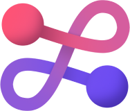

<div align="center">
  <a href="https://github.com/fission-codes/rust-template" target="_blank">
    </img>
  </a>

  <h1 align="center">rust-template</h1>

  <p>
    <a href="https://github.com/fission-codes/rust-template/actions?query=">
      
    </a>
    <a href="./LICENSE-APACHE">
      
    </a>
    <a href="./LICENSE-MIT">
      
    </a>
    <a href="https://discord.gg/AunfpqKUHU">
      
    </a>
  </p>
</div>

##

This template repository is [Fission's][fission] opinionated [Rust][rust],
Rust [web framework][axum], and [Rust][rust]+[WebAssembly][wasm] (Wasm) project
generator, which uses the [cargo-generate][cargo-generate] tool.

These templates provide various features for getting-up and running with Rust or
Rust *and* Wasm, including:

* README standardization, code of conduct, contribuing guidelines, and
  a consistent project layout
* GitHub issue and pull-request templates
* A highly-opinionated [axum][axum] middleware-extensive webserver, focused heavily on
  observability and flexibility
* Some choice default Rust dependencies (particularly for Wasm) including
  [`wasm-bindgen`][wasm-bindgen]
* [`cargo-bench`][cargo-bench] scaffolding (*optional*)
* Release GitHub Action workflow(s) using the
  [release-please-action][release-please-action] and the
  [release-please][release-please] deploy strategy (*optional*)
  * For Wasm libraries, this includes publishing to npm with
    [wasm-pack][wasm-pack], reliant on the Cargo version for the Wasm package.
* Test, lint, audit, and code coverage (via [Codecov][codecov]) GitHub Action
  workflows (*optional*)
* Cross-compile-compatible (`arm64`, `amd64`), [buildx][buildx]-focused
  [Dockerfiles][dockerfile]—pick a `musl` or `glibc` build—for binary
  executables (*right now*), as well as an associated GitHub Action for building
  and pushing to [GitHub Packages Registry][gh-registry] and
  [Docker Hub][dockerhub].
* [Pre-commit][pre-commit] and [rustfmt][rustfmt] opinionated defaults
* [Dependabot][dependabot] support (*optional*)
* [Nix flake][nix-flake] support (*optional*)
* A choice of an [Apache][apache], [MIT][mit], or a dual Apache/MIT license

## Outline

- [Project Templates](#project-templates)
- [Getting Started](#getting-started)
- [Contributing](#contributing)
- [Template References](#template-references)
- [Thanks](#thanks)
- [License](#license)

## Project Templates

This repository contains two sub-templates:

* `rust`: for generating a rust-only library, webserver, or binary/executable
  project.
* `rust+wasm` for generating a [cargo workspace][cargo-workspace]
  with a rust-only crate of the project (library or binary) and another crate
  for wasm-bindings (library-only), meant for execution in [Node.js][node-js]
  or running in modern browsers and/or with bundlers like [webpack][webpack].

## Getting Started

First, install [cargo-generate][cargo-generate] via `cargo install cargo-generate`.
More installation options are available [here][cargo-generate-install].

The experience running through the experience should look something like this:


### Generating a Rust-Only Project

The `rust` template is designed for generating a rust binary or application
library.

- Generate a binary project, for example an [axum][axum] webserver:

  ``` console
  cargo generate --bin --git https://github.com/fission-codes/rust-template
  ```
*Note on binary crate types*: If using the `--bin` flag, this template will
generate a Rust binary project scaffolding with both a `src/main.rs` and a
`src/lib.rs`. This allows for better support for
[integration testing][integration-testing] and helps with
[separation of concerns][sep-of-concerns].

- Generate an application library project:

  ``` console
  cargo generate --lib --git https://github.com/fission-codes/rust-template
  ```

- Generate a project from src, locally:

  ``` console
  cargo generate --lib --path fission-codes/rust-template/
  ```

*Note on SSH-Keys*: When genearting a project/repository, please be aware
that RSA keys used with SHA-1 signatures are [no longer supported by
GitHub][github-rsa]. There is currently [an issue][cargo-generate-issue] in the
`cargo-generate` repository involving an `id_rsa` default. If you run into an
associated error using the template, please specify your private key when
generating a project/repository like so:

```console
cargo generate -i ~/.ssh/id_ed25519 https://github.com/fission-codes/rust-template
```

#### 🔋 Batteries Included

- [`anyhow`][anyhow] as a ergonomic and idiomatic alternative for handling
  errors in applications, and [`thiserror`][thiserror] for designing
  dedicated error type(s) in libraries so that on failures the caller gets
  exactly the information chosen.
- [`proptest`][proptest] and [`criterion`][criterion] for generating inputs and
  running benchmarks (*optional*).
- [`tracing`][tracing] for instrumenting Rust programs to collect structured,
  event-based diagnostic information, going beyond just logging-style
  diagnostics.
- [`tracing-subscriber`][tracing-subscriber] for Rust binary applications
  to collect trace data, such as by logging it to standard output, and
  consume messages emitted by log-instrumented libraries and modules.
- An option to generate a highly opiniated [`axum`][axum] web application stack.

#### 🔋 Batteries Included Web Framework

If you choose to run a webserver with [`axum`][axum] (choosing `true` at the
prompt), you'll be given an extensive web framework to work from, heavily
influenced by [*Composing an observable Rust application*][composing-rust],
among other sources.

- [`anyhow`][anyhow] as a ergonomic and idiomatic alternative for handling
  errors in applications.
- [`axum`][axum] as the fundamenal, already-🔋's included web framework that
  serves as our foundation, which includes high-level features like:
  * Routing requests to handlers with a macro free API
  * Declaratively parsing requests using extractors.
  * Subscribing to a simple and predictable error handling model, which we
    further simplify in our generated template.
  * Generating responses with minimal boilerplate.
  * Taking full advantage of the [tower][tower] and [tower-http][tower-http]
    ecosystem of middleware, services, and utilities.
- Template-specific extensions to `axum`, including
  * An enhanced [Json][axum-json] extractor for better handling of
    [`Unprocessable Entity`][422] responses.
  * A generic `AppError` type for encoding [JSONAPI error object responses][json-error].
  * A macro for generating [typed HTTP headers][typed-headers], for example

    ``` rust
    header!(XDummyId, XDUMMY_ID, "x-dummy-id");

    fn test_dummy_header() {
        let s = "18312349-3139-498C-84B6-87326BF1F2A7";
        let dummy_id = test_decode::<XDummyId>(&[s]).unwrap();
        let headers = test_encode(dummy_id);
        assert_eq!(headers["x-dummy-id"], s);
    }
    ```
  * Built-in `healthcheck`, `ping` *GET* route handlers, as well as a
    [fallback route handler][axum-fallback] and decorated layers for
    [catching panics][tower-catch-panic], handling server timeouts,
    setting [ulid][ulid] request-ids per request, and marking sensitive
    headers on both requests and responses.
  * Graceful shutdown of server when `Ctrl-c`'ed or terminated.
- [`config-rs`][config-rs] for layered configuration settings and using
  `APP` prefixed environment variables for (overrding) configuration.

   We provide a default for application settings (*note*: metrics and server
   ports are provided through `cargo generate` prompts):

   ```toml
   [monitoring]
   process_collector_interval = 10

   [otel]
   exporter_otlp_endpoint = "http://localhost:4317"

   [server]
   environment = "local"
   metrics_port = 4000
   port = 3000
   timeout_ms = 30000
   ```
- [`metrics-rs`][metrics-rs] for application instrumentation, including counters,
  gauges, histograms, and more.
- [`opentelemetry-rust`][otel-rust] and [`axum-tracing-opentelemetry`][otel-axum]
  for integrating `axum` and `tracing` with [opentelemetry][otel], the
  well-known observability framework and specification for capturing telemetry
  data and supporting distributed tracing context propagation. Here's an example set of
  logs displaying `OTEL` spec fields, among other contextual information:

  ```console
  level=INFO span_name="HTTP request" span=2251799813685249 span_event=new_span timestamp=2023-01-29T15:06:42.188395Z http.method=GET http.client_ip=127.0.0.1:59965 http.host=localhost:3000 trace_id=fa9754fa3142db2c100a8c47f6dd391d http.route=/ping
  level=INFO subject=request category=http.request msg="started processing request" request_path=/ping authorization=null target="project::middleware::logging" location="project/src/middleware/logging.rs:123" timestamp=2023-01-29T15:06:42.188933Z span=2251799813685249 otel.name="GET /ping" http.method=GET http.scheme=HTTP http.client_ip=127.0.0.1:59965 http.flavor=1.1 otel.kind=server http.user_agent=curl/7.85.0 http.host=localhost:3000 trace_id=fa9754fa3142db2c100a8c47f6dd391d http.target=/ping http.route=/ping
  level=INFO span_name="HTTP request" span=2251799813685249 span_event=close_span timestamp=2023-01-29T15:06:42.192221Z http.method=GET latency_ms=3 http.client_ip=127.0.0.1:59965 http.host=localhost:3000 trace_id=fa9754fa3142db2c100a8c47f6dd391d http.route=/ping
  ```
- [`proptest`][proptest] and [`criterion`][criterion] for generating inputs and
  running benchmarks (*optional*).
- [`reqwest`][reqwest] as the default HTTP client library and
  [`reqwest-middleware`][reqwest-middleware] as a wrapper around `reqwest` for
  client middleware chaining, giving us retries and tracing out of the box.
- [`sysinfo`][sysinfo] for monitoring process information like memory, disk
  usage, etc. This information is automatically represented and tracked as
  [gauges][metrics-gauge] for [Prometheus][prom] scraping/export for example.
- [`tracing`][tracing] for instrumenting Rust programs to collect structured,
  event-based diagnostic information, going beyond just logging-style
  diagnostics.
- [`tracing-subscriber`][tracing-subscriber] for Rust binary applications
  to collect trace data, such as by logging it to standard output, and to
  consume messages emitted by log-instrumented libraries and modules.

  For `axum` projects, we include a compositon of tracing subscribers from
  smaller units of behavior, called [layers][tracing-layers], for collecting,
  augmenting, and logging (as structured logs) trace data. These layers tap into
  hooks triggered throughout a [span’s lifecycle][tracing-span-life]. You can
  find them [here](./rust/src.axum/tracing_layers).

  Event logs are formatted in [`logfmt`][logfmt], as a series of key/value
  pairs. The implementation of the log generation is inspired by
  [influxdata's (Influx DB's) version][influx-logfmt].
- [`utoipa`][utoipa] for compile-time, auto-generated [OpenAPI][openapi]
  documentation and serving it via [Swagger UI][swagger]. This works
  as a [Procedural `attribute macro`][proc-attr-macro], for example:

  ```rust
  #[utoipa::path(
      get,
      path = "/ping",
      responses(
          (status = 200, description = "Ping successful"),
          (status = 500, description = "Ping not successful", body=AppError)
      )
  )]
  pub async fn get() -> AppResult<StatusCode> {
      Ok(StatusCode::OK)
  }
  ```
- [`wiremock-rs`][wiremock-rs] to provide HTTP mocking to perform black-box
  testing of Rust applications that interact with third-party client APIs. This is
  exemplified through the given [integration test](./rust/tests/integration_test.axum.rs)
  when choosing `axum` as a prompt.


### Generating a Rust+Wasm Workspace Project

The `rust+wasm` template is designed for generating a [workspace][cargo-workspace]
containing both rust-native library or binary code, as well a library for
compilation to Wasm and leveraging [wasm-pack][wasm-pack]. We don't currently
support any Javascript examples or frameworks that can use Wasm npm package
explicitly, but this is on our radar. Additionally, when using the `--bin` flag
you have the option to generate our [axum][axum] template with
all the 🔋's [mentioned above](#-batteries-included-web-framework).

Generate a project just like before and choose the `rust+wasm` template:

```console
cargo generate --lib --git https://github.com/fission-codes/rust-template
```

*Note*: Currently, `wasm-pack` [does not support building binary
 crates][no-binary], so even with the `--bin` flag specified, a library
will still be generated.

#### 🔋 Batteries Included

- [`wasm-bindgen`][wasm-bindgen] for communicating
  between WebAssembly and JavaScript.
- [`wasm-bindgen-futures`][wasm-bindgen-futures] for converting between
  Javascript Promises and Rust futures.
- [`console_error_panic_hook`][console-hook]
  for logging panic messages to the developer console.
- [`js-sys`][js-sys] for bindings to Javascript's standard, built-in
  objects.
- [`web-sys`][web-sys] for bindings to Web APIs like `window.fetch`, WebGL,
  WebAudio, etc. (*optional*, via feature-flag).

### Generation in an existing project

The generator is also designed for templating within an existing project and
prompts with this in mind. To generate in an existing project, run this command
in the project root:

  ``` console
  cargo generate --git https://github.com/fission-codes/rust-template --init
  ```

When taking this approach, please be aware that some of the generated code,
e.g. benches, READMEs, etc., rely on dependencies or contain text that may
not be set in or follow the layout of your existing Rust codebase, so please
make the appropriate changes where needed.

If the generator detects a conflict, it will not alter your project in any way,
failing with an error. **We can't cover all the cases when extending an existing
project**. If you run into problems, open an [issue][gh-issues].

### Notes for Post-Project Generation

- If using `nix` via [Nix flake][nix-flake], please install [nix][nix] and
  [direnv][direnv] to get started. Then, make sure to run `direnv allow`
  and add your files via `git add`.

- If [Codecov][codecov] upload is enabled through GitHub Actions make
  sure to sync your project and gather tokens/badges. Read more
  [here][codecov-quick].

- There are stock integration tests available for all templates, including
  a [wasm-bindgen][wasm-bindgen] decorated test, `#[wasm_bindgen_test]`, that
  can be tested with [wasm-pack][wasm-pack].

- For CI/CD purposes, be aware there's [some secrets you'll need to configure
  in Github][gh-secrets], including:
  * `CODECOV_TOKEN` if you choose to use coverage via [Codecov][codecov]
  * `CARGO_REGISTRY_TOKEN` for publshing Rust packages to [crates.io][crates-io]
  * `NPM_TOKEN` for publishing a Wasm project to [npm][npm]
  * `DOCKERHUB_USERNAME` and `DOCKERHUB_TOKEN` for pushing containers to Docker
    Hub.

## Contributing

:balloon: We're thankful for any feedback and help in improving our template
generator! We have a [contributing guide](./CONTRIBUTING.md) to help you get
involved. We also adhere to Fission's [Code of Conduct](./CODE_OF_CONDUCT.md).

### Pre-commit Hook

This repository recommends using [pre-commit][pre-commit] for running pre-commit
hooks. Please run this before every commit and/or push.

- Once installed, Run `pre-commit install` and `pre-commit install --hook-type commit-msg`
  to setup the pre-commit hooks locally. This will reduce failed CI builds.
- If you are doing interim commits locally, and for some reason if you _don't_
  want pre-commit hooks to fire, you can run
  `git commit -a -m "Your message here" --no-verify`.

## Template References

- [bevy-template-rs][bevy-template]
- [rust-nix-template][rust-nix-template]
- [wasm-pack-template][wasm-pack-template]

## Thanks

Major shout-outs to the various contributors of this work, including:

- [@bgins](https://github.com/bgins)
- [@BoisterousCoder](https://github.com/BoisterousCoder)
- [@QuinnWilton](https://github.com/QuinnWilton)
- [@expede](https://github.com/expede)
- [@pauljamescleary](https://github.com/pauljamescleary)
- [@drunkirishcoder](https://github.com/drunkirishcoder)
- [@jaredmorrow](https://github.com/jaredmorrow)
- [@glitchy](https://github.com/glitchy)
- [@jwhittle933](https://github.com/jwhittle933)
- [@walkah](https://github.com/walkah)

## License
This project is licensed under either of

- Apache License, Version 2.0, ([LICENSE-APACHE](./LICENSE-APACHE) or
  [http://www.apache.org/licenses/LICENSE-2.0][apache])
- MIT license ([LICENSE-MIT](./LICENSE-MIT) or
  [http://opensource.org/licenses/MIT][mit])

at your option.

### Contribution

Unless you explicitly state otherwise, any contribution intentionally
submitted for inclusion in the work by you, as defined in the Apache-2.0
license, shall be dual licensed as above, without any additional terms or
conditions.

[422]: https://developer.mozilla.org/en-US/docs/Web/HTTP/Status/422
[apache]: https://www.apache.org/licenses/LICENSE-2.0
[anyhow]: https://github.com/dtolnay/anyhow
[axum]: https://docs.rs/axum/latest/axum/
[axum-fallback]: https://docs.rs/axum/latest/axum/routing/struct.Router.html#method.fallback
[axum-json]: https://docs.rs/axum/latest/axum/struct.Json.html
[buildx]: https://github.com/docker/buildx
[bevy-template]: https://github.com/taurr/bevy-template-rs
[cargo-bench]: https://doc.rust-lang.org/cargo/commands/cargo-bench.html
[cargo-generate]: https://github.com/cargo-generate/cargo-generate
[cargo-generate-init]: https://cargo-generate.github.io/cargo-generate/usage.html#generating-into-current-dir
[cargo-generate-install]: https://github.com/cargo-generate/cargo-generate#installation
[cargo-generate-issue]: https://github.com/cargo-generate/cargo-generate/issues/384
[cargo-workspace]: https://doc.rust-lang.org/cargo/reference/workspaces.html
[codecov]: https://about.codecov.io/
[codecov-quick]: https://docs.codecov.com/docs/quick-start
[composing-rust]: https://blog.logrocket.com/composing-underpinnings-observable-rust-application/
[config-rs]: https://github.com/mehcode/config-rs
[console-hook]: https://github.com/rustwasm/console_error_panic_hook
[crates-io]: https://crates.io/
[criterion]: https://github.com/bheisler/criterion.rs
[dependabot]: https://github.com/dependabot
[direnv]:https://direnv.net/
[dockerfile]: https://docs.docker.com/engine/reference/builder/
[dockerhub]: https://hub.docker.com/
[fission]: https://fission.codes/
[gh-issues]: https://github.com/fission-codes/rust-template/issues
[gh-registry]: https://github.com/features/packages
[github-rsa]: https://github.blog/2021-09-01-improving-git-protocol-security-github/
[gh-secrets]: https://docs.github.com/en/rest/actions/secrets
[influx-logfmt]: https://github.com/influxdata/influxdb_iox/tree/main/logfmt
[integration-testing]: https://doc.rust-lang.org/book/ch11-03-test-organization.html#integration-tests-for-binary-crates
[json-error]: https://jsonapi.org/examples/#error-objects
[js-sys]: https://docs.rs/js-sys/latest/js_sys/
[logfmt]: https://brandur.org/logfmt
[metrics-gauge]: https://docs.rs/metrics/latest/metrics/macro.gauge.html
[metrics-rs]: https://github.com/metrics-rs/metrics
[mit]: http://opensource.org/licenses/MIT
[nix]:https://nixos.org/download.html
[nix-flake]: https://nixos.wiki/wiki/Flakes
[node-js]: https://nodejs.dev/en/
[no-binary]: https://github.com/rustwasm/wasm-pack/issues/734
[npm]: https://www.npmjs.com/
[openapi]: https://swagger.io/specification/
[otel]: https://opentelemetry.io/docs/
[otel-axum]: https://github.com/davidB/axum-tracing-opentelemetry
[otel-rust]: https://docs.rs/opentelemetry/latest/opentelemetry/
[pre-commit]: https://pre-commit.com/
[proc-attr-macro]: https://doc.rust-lang.org/reference/procedural-macros.html#attribute-macros
[prom]: https://prometheus.io/
[proptest]: https://github.com/proptest-rs/proptest
[release-please]: https://github.com/googleapis/release-please
[release-please-action]: https://github.com/google-github-actions/release-please-action
[reqwest]: https://github.com/seanmonstar/reqwest
[reqwest-middleware]: https://github.com/TrueLayer/reqwest-middleware
[rust]: https://www.rust-lang.org/
[rust-nix-template]: https://github.com/nerosnm/rust-nix-template
[rustfmt]: https://github.com/rust-lang/rustfmt
[sep-of-concerns]: https://doc.rust-lang.org/stable/book/ch12-03-improving-error-handling-and-modularity.html#separation-of-concerns-for-binary-projects
[sysinfo]: https://github.com/GuillaumeGomez/sysinfo
[swagger]: https://swagger.io/tools/swagger-ui/
[thiserror]: https://github.com/dtolnay/thiserror
[tower]: https://crates.io/crates/tower
[tower-catch-panic]: https://docs.rs/tower-http/latest/tower_http/catch_panic/struct.CatchPanic.html
[tower-http]: https://crates.io/crates/tower-http
[tracing]: https://github.com/tokio-rs/tracing
[tracing-layers]: https://docs.rs/tracing-subscriber/latest/tracing_subscriber/layer/index.html
[tracing-span-life]: https://docs.rs/tracing/latest/tracing/span/index.html#the-span-lifecycle
[tracing-subscriber]: https://docs.rs/tracing-subscriber/latest/tracing_subscriber/index.html
[typed-headers]: https://docs.rs/headers/0.3.8/headers/index.html
[ulid]: https://github.com/ulid/spec
[utoipa]: https://github.com/juhaku/utoipa
[wasm]: https://webassembly.org/
[wasm-bindgen]: https://github.com/rustwasm/wasm-bindgen
[wasm-bindgen-futures]: https://rustwasm.github.io/wasm-bindgen/api/wasm_bindgen_futures/
[wasm-pack]: https://rustwasm.github.io/docs/wasm-pack/
[wasm-pack-template]: https://github.com/rustwasm/wasm-pack-template
[webpack]: https://webpack.js.org/
[web-sys]: https://rustwasm.github.io/wasm-bindgen/api/web_sys/
[wiremock-rs]: https://github.com/LukeMathWalker/wiremock-rs
